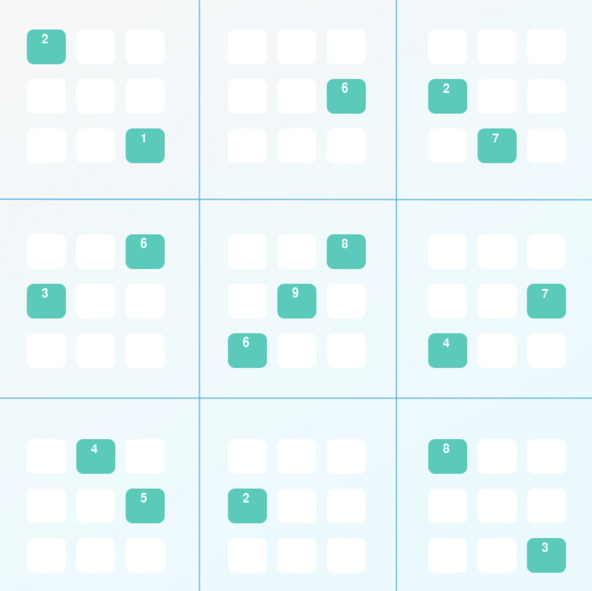
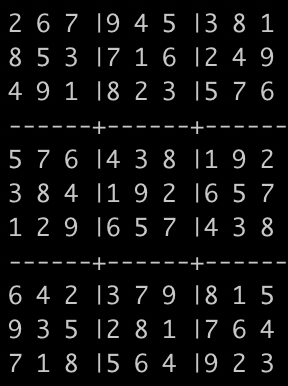

# AI Technique to solve Sudoku

<p style="text-align:center;">


</p>

In this project, we developed Sudoku-solving agent to solve [_diagonal sudoku puzzles_](https://sudoku.cool/x-sudoku.php) and implement a constraint strategy called [naked twins](./pseudocode.md). A diagonal Sudoku puzzle is identical to traditional Sudoku puzzles with the added constraint that the boxes on the two main diagonals of the board must also contain the digits 1-9 in each cell (just like the rows, columns, and 3x3 blocks).

The naked twins strategy says that if we have two or more unallocated boxes in a unit and there are only two digits that can go in those two boxes, then those two digits can be eliminated from the possible assignments of all other boxes in the same unit.

## Techniques

- Constraint Propagation
- Depth-first Search Algorithm

## Quickstart Guide

Everything needed to run this project has been exported as conda environment. Install [conda](https://docs.conda.io/projects/conda/en/latest/user-guide/install/) according to your system, once it is installed, import the enviroment from `environment.yml` file.

```bash
conda env create -f environment.yml     # import the conda environment
conda activate aind                     # activates it
```

Before running the agent, make sure that all checks passed by running the test suite.

```bash
python -m unittest -v
```

If all checks are clear, the agent can be run from the CLI using the following command

```bash
python solution.py
```

## Strategy Guide

### 1. Constraint Propagation

We use several contraints to solve this puzzle,

- **elimination contraint**

> When a box has been assigned a digit, then all peers of this box can't have the same digit.

- **only choice constraint**

> When only one box in a unit allows a certain digit, then that box must be assigned that digit.

- **naked twins contraint**

> When two or more unallocated boxes in a unit has the same two digit option that can be assigned to them, then these two digits can be eliminated from the assignment of all other boxes in the same unit

### 2. Depth-first search

Depth-first search is used when our agent is faced with two or more possible outcome. In this situation, we are going to execute each options one-by-one until we find the final solution or encounter an error. If we found several options that can solve the puzzle, depth-first search will pick the option that returns the solution earlier based on [depth-first strategy](https://en.wikipedia.org/wiki/Depth-first_search).

## Visualization

**Note:** The `pygame` library is required to visualize your solution -- we have include it with the `aind` environment, however, the `pygame` module can be troublesome to install and configure, and it is not reliable across all operating systems or versions. Please refer to the pygame documentation [here](http://www.pygame.org/download.shtml) to troubleshoot pygame.

Running `python solution.py` will automatically attempt to visualize our solution.
